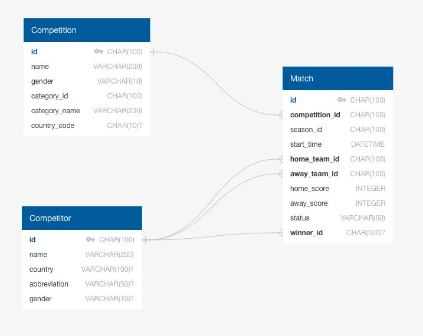

# Soccer Fan Hub

This website will be all about women's professional soccer.

## Main Features

- **Competitions List:** Browse a comprehensive list of competitions ordered by country.
- **Competitors List:** Explore competitors participating in each competition.
- **Match Details:** View details of live, upcoming and past matches by competitor.

## Technologies Used

- **Frontend:** React
- **Backend:** Django
- **Database:** Postgres
- **APIs:** Integrated soccer data APIs for live scores and match details.
- **Containerization:** Docker, Docker Compose

## Database Schema

## Stretch Goals

- **Filtering Options:** Find matches by country, location, league, or date.
- **User Authentication:** Allow users to register and log in.
- **Favorite Teams and Matches:** Let users choose and manage their favorite teams.
